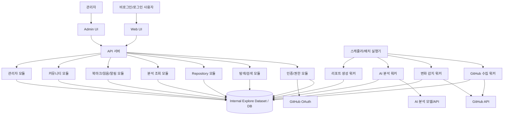
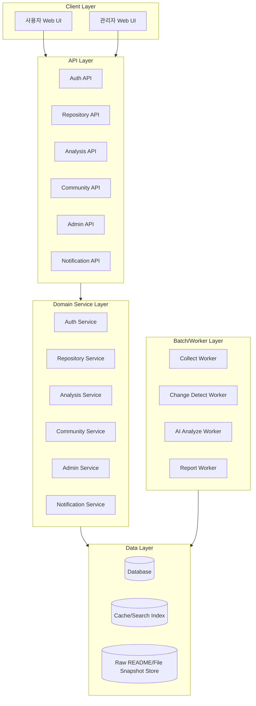
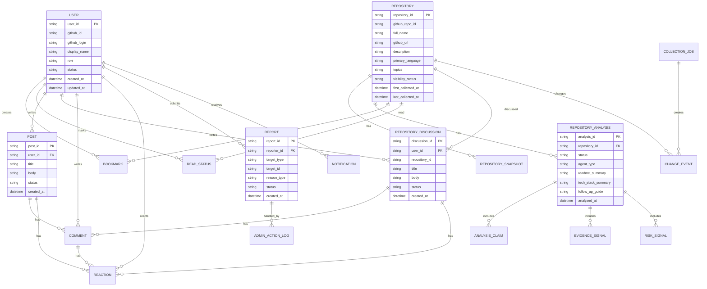
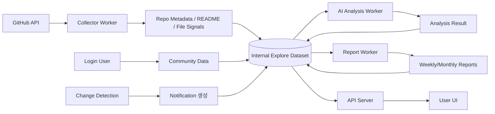
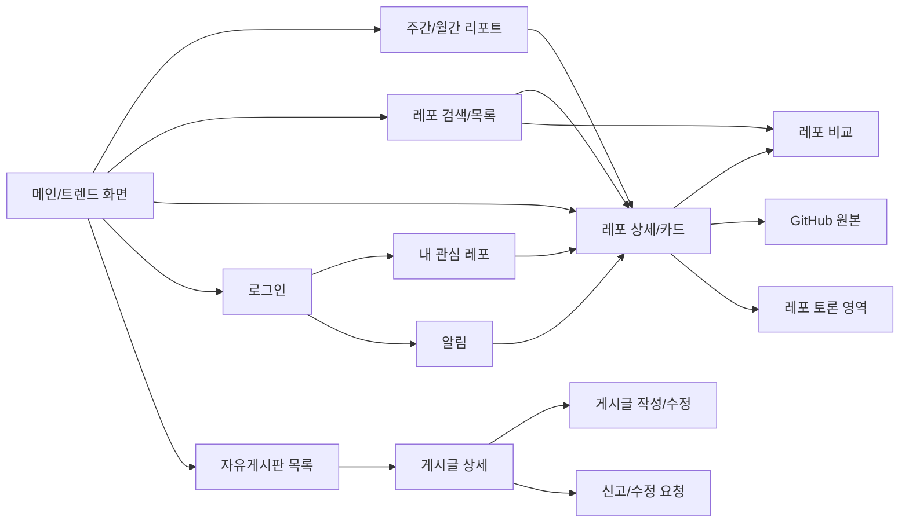
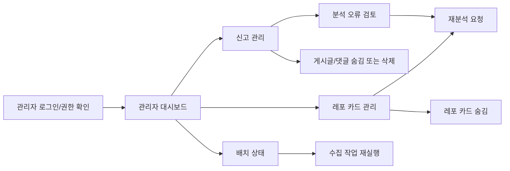
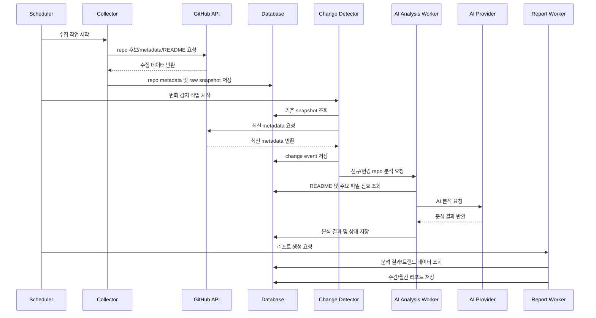
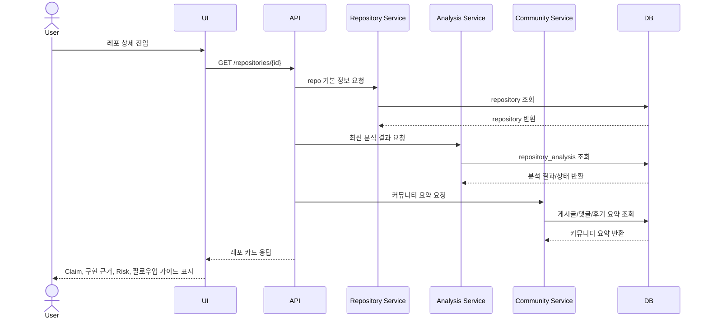
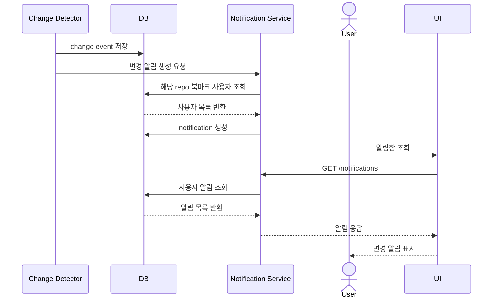
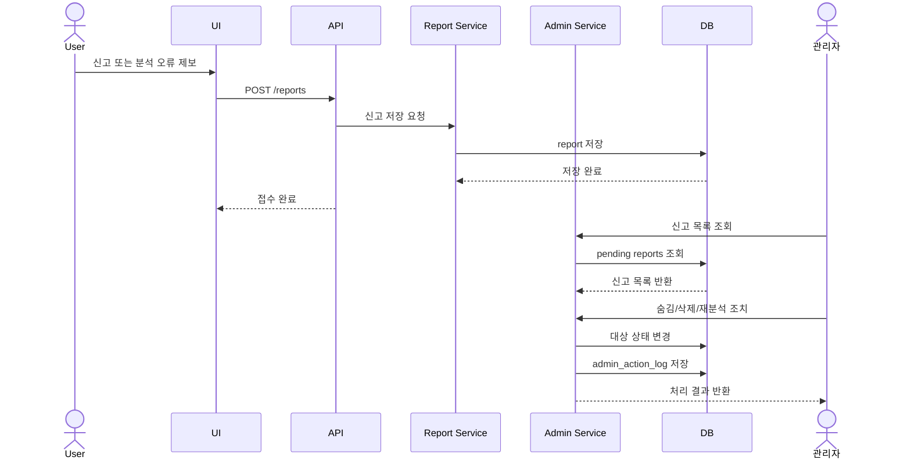

# AgentHub 시스템 설계서

## 1. 문서 개요

|항목|내용|
|---|---|
|문서명|AgentHub 시스템 설계서|
|작성 목적|AgentHub의 시스템 구조, 모듈, 인터페이스, 데이터, 화면, 업무 흐름, 보안, 성능, 운영, 테스트 관점을 정의하여 개발자와 운영자가 구현 및 운영 방향을 이해할 수 있도록 한다.|
|대상 시스템|AgentHub|
|시스템 별칭|최종 서비스명칭은 `AgentHub`로 확정 및 통일하여 사용함.|
|적용 범위|GitHub 기반 AI Agent 오픈소스 수집, 분석, 탐색, 리포트, 레포지토리 카드, 북마크, 알림, 커뮤니티, 관리자 기능|
|작성 기준|시스템정의서, 요구사항정의서, 유즈케이스 문서에 명시된 내용을 우선 반영|
|참고 문서|시스템정의서.md, 요구사항정의서.md, 유즈케이스.md|
|작성 원칙|문서에 명시되지 않은 기술·수치·정책은 `[확인 필요]`로 표시하고, 합리적 설계 추론은 `[추정]`으로 표시|

---

## 2. 시스템 개요

### 2.1 시스템 목적

AgentHub는 개인 개발자가 빠르게 변화하는 AI Agent 기술 흐름을 따라가기 위해 GitHub 오픈소스 프로젝트를 수집·분석하고, AI 기반 분석 결과와 커뮤니티 신호를 분리하여 제공하는 기술 탐색 커뮤니티 서비스이다.

시스템의 핵심 목적은 다음과 같다.

|목적|설명|
|---|---|
|Agent 오픈소스 탐색 비용 절감|GitHub에 지속적으로 등장하는 Agent, MCP, Skill, Eval, Tool-use 관련 레포지토리를 빠르게 파악할 수 있게 한다.|
|README Claim과 구현 근거 구분|README 주장과 실제 파일·디렉토리·설정 기반 구현 신호를 구분하여 제공한다.|
|팔로우업 대상 선정 지원|사용자가 어떤 레포지토리를 먼저 확인해야 하는지 판단할 수 있도록 레포지토리 카드와 팔로우업 가이드를 제공한다.|
|커뮤니티 신호 축적|개발자들이 실행 경험, 후기, 보완 정보, 오류 제보, 토론을 남길 수 있게 한다.|
|자동 분석과 커뮤니티 분리|AI 분석 결과와 사용자 피드백을 별도 데이터로 관리하여 신뢰도를 확보한다.|

### 2.2 주요 사용자

|사용자 유형|설명|주요 권한|
|---|---|---|
|비로그인 사용자|공개 정보를 탐색하는 사용자|레포지토리 목록 조회, 리포트 조회, 레포 상세 조회, 커뮤니티 조회|
|로그인 사용자|GitHub OAuth로 인증한 개발자|북마크, 읽음 처리, 댓글, 게시글, 반응, 신고, 보완 제안, 알림 수신|
|관리자|서비스 품질과 커뮤니티 신뢰도를 관리하는 운영자|커뮤니티 신호 숨김/삭제, 신고 검토, 레포지토리 카드 숨김, 재분석 요청, 배치 상태 조회|
|시스템|정기 수집·분석·갱신을 수행하는 자동 처리 주체|GitHub 수집, README 수집, 변화 감지, AI 분석, 리포트 생성|

### 2.3 주요 기능

|구분|주요 기능|
|---|---|
|탐색|주간/월간 리포트 조회, 트렌드 레포 조회, MCP/Skill/Eval 흐름 탐색, 레포 검색|
|Repository|레포 목록, 레포 상세, 레포 비교, 레포지토리 카드, GitHub 원본 링크|
|AI 분석|README 요약, Claim 추출, 핵심 구조 분석, 기술 스택 분석, 구현 근거 요약, 위험 요소 분석|
|관심 관리|북마크, 읽음 처리, 관심 레포 목록, 변경 알림|
|커뮤니티|자유게시판, 레포별 토론방, 댓글, 반응, 사용 후기, 실행 경험 공유, 신고|
|관리자|신고 조회, 게시글/댓글 숨김·삭제, 레포지토리 카드 관리, 재분석 요청, 배치 상태 조회|
|시스템 자동 처리|GitHub Repo 수집, README 수집, 변화 감지, 트렌드 점수 계산, 랭킹 갱신, AI 분석 요청, 주간 리포트 생성|

### 2.4 운영 환경

|항목|내용|
|---|---|
|서비스 형태|웹 기반 서비스 `[추정]`|
|지원 환경|PC 및 모바일 반응형 웹|
|외부 연동|GitHub API, GitHub OAuth, AI 분석 모델/API `[확인 필요]`|
|데이터 제공 방식|사용자 요청마다 GitHub API를 직접 호출하지 않고 내부 Explore Dataset 기반으로 제공|
|데이터 갱신 방식|정기 수집 및 증분 갱신 중심|
|운영 시간|24시간 서비스 이용 가능 요구|
|배포 환경|`[확인 필요]`|
|운영 인프라|`[확인 필요]`|

### 2.5 시스템 범위

#### 포함 범위

|범위|설명|
|---|---|
|GitHub Agent 관련 repo 수집|AI Agent, Agent Framework, Coding Agent, Browser Agent, Multi-Agent System 등|
|MCP/Skill/Eval/Tool-use 탐지|Agent Engineering 관련 정적 신호 탐지|
|AI 분석|README 요약, Claim 추출, 구조 분석, 위험 요소 분석|
|레포지토리 카드|프로젝트명, GitHub URL, 설명, 유형, Claim, 구현 근거, Risk, 팔로우업 가이드|
|Period/주간 탐색 리포트|특정 기간의 Agent Engineering 흐름 요약|
|팔로우업 목록|사용자가 확인할 가치가 있는 repo 또는 기술 흐름 제공|
|관심 관리|북마크, 읽음 처리, 변경 알림|
|커뮤니티|자유게시판, 레포별 토론방, 댓글, 반응, 신고|
|관리자|커뮤니티 관리, 레포지토리 카드 관리, 재분석 요청|

#### 제외 범위

|제외 범위|설명|
|---|---|
|전체 코드 정밀 분석|MVP 제외|
|실제 benchmark 실행|MVP 제외|
|런타임 실행 추적|MVP 제외|
|보안 취약점 정밀 진단|MVP 제외|
|모든 GitHub Trending 분석|MVP 제외|
|모든 언어별 AST 분석|MVP 제외|
|모든 repo 매일 전체 AI 재분석|MVP 제외|
|완전 자동 아키텍처 역공학|MVP 제외|
|복잡한 점수 산식 확정|초기 단계에서 확정하지 않음|

---

## 3. 요구사항 반영 현황

### 3.1 기능 요구사항 반영 현황

|요구사항 ID|요구사항명|요구사항 설명|설계 반영 위치|반영 여부|비고|
|---|---|---|---|---|---|
|F01|회원가입 및 로그인|GitHub OAuth 및 JWT 기반 세션 처리|6, 10, 14장|반영|자체 이메일 회원가입은 MVP 제외|
|F02|주간 탐색 리포트 조회|주간, 월간 AI 오픈소스 트렌드 리포트 조회|4, 5, 7, 8, 9장|반영|월간 리포트 포함|
|F03|MCP / Skill / Eval 흐름 탐색|특정 기술 흐름 및 Agent 트렌드 탐색|5, 7, 8장|반영|분류 기준 상세화 필요|
|F04|인기 Repository 조회|트렌드 점수 기반 인기 레포 목록 제공|5, 7, 8장|부분 반영|점수 산식은 `[확인 필요]`|
|F05|Repository 검색|언어, 토픽, 기간 기준 검색|5, 6, 7, 8장|반영|검색 인덱스 방식은 `[추정]`|
|F06|Repository 비교|최대 3개 레포 비교 분석|5, 6, 8, 9장|반영|우선순위 낮음|
|F07|README 요약|AI 기반 README 요약|5, 6, 7, 9장|반영|AI 모델 확정 필요|
|F08|핵심 구조 분석|디렉토리 구조 및 핵심 파일 분석|5, 7, 9장|반영|MVP는 정적 신호 기반|
|F09|기술 스택 분석|Framework, DB, Queue 등 사용 기술 분석|5, 7장|반영|탐지 정확도 기준 `[확인 필요]`|
|F10|위험 요소 분석|Deprecated 여부, 유지보수 위험 분석|5, 7장|반영|위험 기준 `[확인 필요]`|
|F11|북마크 기능|관심 레포 북마크|5, 6, 7, 8, 9장|반영|로그인 필요|
|F12|관심 레포 변경 알림|북마크 레포 변경 시 사이트 내 알림|5, 6, 7, 9, 12장|반영|알림 채널은 사이트 내 알림|
|F13|자유게시판 이용|AI/Agent 관련 게시글 CRUD|5, 6, 7, 8, 9장|반영|비로그인은 조회만|
|F14|레포별 토론방|레포별 게시글 작성 및 토론|5, 6, 7, 8, 9장|반영|레포 상세 화면 연동|
|F15|댓글 이용|게시글 댓글 CRUD|5, 6, 7, 8, 9장|반영|권한 검증 필요|
|F16|신고 기능|부적절 게시글 및 댓글 신고|5, 6, 7, 9, 10장|반영|관리자 검토 흐름 포함|
|F17|GitHub Repository 수집|GitHub API로 repo 데이터 주기 수집|4, 5, 6, 7, 9, 12장|반영|Rate Limit 대응 필요|
|F18|README 분석|수집 README 기반 AI 분석|5, 6, 7, 9장|반영|실패 상태 저장|
|F19|Repository 변화 감지|star 증가량 및 업데이트 여부 감지|5, 7, 9, 12장|반영|변경 기준 `[확인 필요]`|
|F20|AI 분석 생성|AI 기반 구조 분석 및 요약 결과 저장|5, 7, 9장|반영|분석 이력 관리 포함|
|F21|데이터 갱신|주기적 Repository 메타데이터 갱신|5, 7, 9, 12, 13장|반영|주기 `[확인 필요]`|
|F22|커뮤니티 신호 숨김/삭제|관리자 커뮤니티 신호 관리|5, 6, 8, 9, 10장|반영|감사 로그 필요 `[추정]`|
|F23|Repository 재분석 요청|관리자 AI 분석 오류 시 재분석 요청|5, 6, 9, 12장|반영|배치 큐 연동 `[추정]`|
|F24|레포지토리 카드 관리|잘못된 카드 숨김 처리|5, 6, 8, 9, 10장|반영|숨김 이력 관리 필요 `[추정]`|

### 3.2 비기능 요구사항 반영 현황

|요구사항 ID|요구사항명|요구사항 설명|설계 반영 위치|반영 여부|비고|
|---|---|---|---|---|---|
|NF01|응답 속도|레포 검색 결과 3초 이내 응답|11장|반영|검색 인덱스/캐시 설계 포함|
|NF02|서비스 안정성|24시간 서비스 이용 가능|12, 13장|반영|SLA 세부 수치 `[확인 필요]`|
|NF03|AI 분석 확장|새로운 AI 분석 기능 쉽게 추가|4, 5, 7, 14장|반영|분석 모듈 분리|
|NF04|JWT 인증|JWT 기반 인증 및 권한 처리|6, 10장|반영|토큰 만료/재발급 정책 `[확인 필요]`|
|NF05|OAuth 토큰 및 JWT 암호화|OAuth 토큰 및 세션 정보 암호화 저장·관리|10장|반영|암호화 방식 `[확인 필요]`|
|NF06|GitHub API Rate Limit 대응|API 제한 발생 시 재시도 및 캐싱|10, 11, 12, 13장|반영|호출 예산 `[확인 필요]`|
|NF07|모듈화 구조|도메인 기반 모듈화|4, 5장|반영|모듈 경계 정의|
|NF08|직관적인 UI/UX|핵심 기능 3클릭 이내 접근|8, 11장|반영|UX 검증 필요|
|NF09|반응형 웹 지원|PC 및 모바일 지원|8, 11, 16장|반영|브레이크포인트 `[확인 필요]`|
|NF10|AI 분석의 한계 처리|실패·근거 부족·불확실성 상태 저장 및 화면 표시|5, 7, 8, 10, 12장|반영|상태 모델 포함|

---

## 4. 시스템 아키텍처 설계

### 4.1 전체 아키텍처 설명

AgentHub는 사용자 요청마다 GitHub API를 직접 호출하지 않고, GitHub API에서 수집한 데이터를 내부 Explore Dataset에 저장한 뒤 분석 결과와 커뮤니티 데이터를 사용자에게 제공하는 구조를 따른다.

전체 구조는 다음 계층으로 구성한다.

|계층|설명|
|---|---|
|Presentation Layer|사용자 웹 UI, 관리자 UI|
|API Layer|인증, 탐색, 레포지토리, 분석, 커뮤니티, 관리자 API 제공|
|Domain Service Layer|도메인별 비즈니스 로직 처리|
|Batch/Worker Layer|GitHub 수집, 변화 감지, AI 분석, 리포트 생성|
|Data Layer|사용자, 레포지토리, 분석 결과, 커뮤니티, 알림, 배치 상태 저장|
|External Integration Layer|GitHub API, GitHub OAuth, AI 분석 모델/API|

### 4.2 전체 아키텍처 다이어그램



### 4.3 주요 구성 요소

|구성 요소|설명|비고|
|---|---|---|
|Web UI|일반 사용자용 화면|반응형 웹|
|Admin UI|관리자 기능 화면|신고, 숨김, 재분석, 배치 상태 조회|
|API 서버|클라이언트 요청 처리|REST API `[추정]`|
|인증/권한 모듈|GitHub OAuth, JWT, 역할 기반 접근 제어|요구사항 명시|
|Repository 모듈|레포 목록, 상세, 비교, 카드 제공|내부 Dataset 기반|
|Analysis 모듈|README 요약, 구조 분석, Risk 조회|생성은 Worker에서 수행|
|Explore/Report 모듈|트렌드, 팔로우업 목록, 주간/월간 리포트 제공|리포트 사전 생성 `[추정]`|
|Community 모듈|자유게시판, 레포 토론, 댓글, 반응, 신고|로그인 사용자 작성|
|Interest 모듈|북마크, 읽음 처리, 변경 알림|로그인 사용자 대상|
|Admin 모듈|신고 처리, 카드 숨김, 재분석 요청|관리자 권한 필요|
|Collector Worker|GitHub repo 후보 및 메타데이터 수집|GitHub API Rate Limit 고려|
|Analysis Worker|AI 분석 생성 및 분석 상태 저장|실패/불확실성 상태 저장|
|Report Worker|주간/월간 리포트 생성|기간 단위 생성|
|Database|내부 Explore Dataset 및 서비스 데이터 저장|DB 종류 `[확인 필요]`|
|Cache/Search Index|검색 응답 속도 개선|`[추정]`|

### 4.4 계층 구조



### 4.5 컴포넌트 간 관계

|관계|설명|
|---|---|
|Web UI → API 서버|사용자 탐색, 검색, 커뮤니티, 북마크 요청|
|Admin UI → API 서버|신고 처리, 재분석 요청, 카드 숨김 요청|
|API 서버 → DB|내부 Dataset 및 서비스 데이터 조회/저장|
|Scheduler → Worker|정기 수집, 변화 감지, 분석, 리포트 생성 실행|
|Collector Worker → GitHub API|레포 후보, 메타데이터, README 수집|
|AI Worker → AI 모델/API|README 요약, Claim 추출, 구조 분석, Risk 분석|
|Worker → DB|분석 결과, 분석 상태, 리포트, 변경 이벤트 저장|
|Interest 모듈 → Notification 모듈|북마크 레포 변경 감지 시 알림 생성|
|Community 모듈 → Admin 모듈|신고 및 숨김 처리 연동|

### 4.6 외부 시스템 연동 구조

|외부 시스템|사용 목적|연동 방식|확인 필요 사항|
|---|---|---|---|
|GitHub OAuth|사용자 소셜 로그인|OAuth 2.0 `[추정]`|OAuth App 설정, Scope, Callback URL|
|GitHub API|Repository 수집, README 수집, 메타데이터 갱신|REST/GraphQL `[확인 필요]`|API 종류, Rate Limit 예산, 토큰 정책|
|AI 분석 모델/API|README 요약, Claim 추출, 구조 분석, Risk 분석|API 호출 `[확인 필요]`|모델, 비용, 토큰 제한, 재시도 정책|
|알림 채널|사이트 내 알림|내부 DB 기반 `[추정]`|이메일/푸시 확장 여부|

---

## 5. 모듈 설계

### 5.1 모듈 목록

|모듈명|역할|주요 기능|입력|출력|연관 요구사항|
|---|---|---|---|---|---|
|Auth 모듈|사용자 인증 및 권한 관리|GitHub OAuth 로그인, JWT 발급, 역할 검증|OAuth Code, JWT|사용자 세션, 권한 정보|F01, NF04, NF05|
|User 모듈|사용자 정보 관리|사용자 프로필, 역할, 상태 관리|사용자 ID|사용자 정보|F01|
|Repository 모듈|레포 데이터 제공|목록, 상세, 검색, 비교, 카드 조회|검색 조건, repo ID|레포 목록/상세/비교 결과|F04, F05, F06|
|Explore/Trend 모듈|트렌드 탐색 제공|주간/월간 리포트, 팔로우업 목록, 기술 흐름 탐색|기간, 카테고리|리포트, 추천 목록|F02, F03, F04|
|Analysis 모듈|AI 분석 결과 관리|README 요약, 구조 분석, 기술 스택, 위험 요소, 분석 상태|repo ID|분석 결과|F07, F08, F09, F10, F18, F20, NF10|
|Collector 모듈|GitHub 데이터 수집|후보 탐색, 메타데이터, README, 파일 구조 수집|검색 쿼리, 수집 대상|raw repo 데이터|F17, F21, NF06|
|Change Detection 모듈|레포 변화 감지|star 증가량, update, release 변경 감지|기존 snapshot, 신규 metadata|변경 이벤트|F12, F19|
|AI Analysis Worker|AI 분석 생성|Claim 추출, 근거 요약, Risk 분석, 상태 저장|README, 주요 파일 신호|분석 결과, 분석 상태|F07~F10, F18, F20|
|Report Worker|리포트 생성|주간/월간 리포트 생성|분석 결과, 트렌드 데이터|리포트|F02|
|Interest 모듈|관심 레포 관리|북마크, 읽음 처리, 관심 목록|사용자 ID, repo ID|관심 상태|F11, UC-04|
|Notification 모듈|알림 관리|변경 알림 생성/조회/읽음 처리|변경 이벤트, 사용자 북마크|알림|F12|
|Community 모듈|커뮤니티 기능|자유게시판, 레포 토론, 댓글, 반응|게시글/댓글/반응 데이터|커뮤니티 콘텐츠|F13, F14, F15|
|Report/Abuse 모듈|신고 및 제보 관리|부적절 콘텐츠 신고, 분석 오류 신고, 보완 제안|신고 데이터|신고 상태|F16, UC-06|
|Admin 모듈|관리자 운영 기능|신고 조회, 숨김/삭제, 재분석 요청, 카드 숨김, 배치 상태 조회|관리자 요청|처리 결과|F22, F23, F24|
|Batch Management 모듈|배치 상태 관리|수집/분석 작업 상태 조회, 재실행|작업 ID|작업 상태|UC 관리자 기능|
|Audit Log 모듈|관리자 및 중요 행위 기록|숨김, 삭제, 재분석 요청, 권한 변경 로그|이벤트|감사 로그|F22~F24, 보안 `[추정]`|

### 5.2 Auth 모듈

|항목|내용|
|---|---|
|모듈 책임|GitHub OAuth 기반 로그인, JWT 발급, 인증 상태 확인, 사용자 역할 검증|
|처리 흐름|1. 사용자가 GitHub 로그인 요청 → 2. GitHub OAuth 인증 → 3. Callback으로 code 수신 → 4. 사용자 정보 조회 → 5. 내부 사용자 생성/갱신 → 6. JWT 발급|
|입력|OAuth code, redirect URI, JWT|
|출력|Access Token/JWT, 사용자 프로필, 권한 정보|
|예외 상황|OAuth 실패, scope 부족, 토큰 만료, JWT 위변조, 탈퇴/제한 사용자|
|다른 모듈과의 관계|Community, Interest, Admin API 호출 시 인증·권한 검증 수행|

### 5.3 Repository 모듈

|항목|내용|
|---|---|
|모듈 책임|내부 Explore Dataset 기반 레포지토리 조회, 검색, 상세, 비교 기능 제공|
|처리 흐름|1. 검색 조건 수신 → 2. 내부 DB/Search Index 조회 → 3. 분석 요약 및 커뮤니티 요약 결합 → 4. 응답 반환|
|입력|repo ID, 검색어, 언어, 토픽, 기간, 카테고리|
|출력|레포 목록, 레포 상세, 비교 결과, 레포지토리 카드|
|예외 상황|숨김 처리된 repo, 분석 실패 repo, 검색 결과 없음, 비교 대상 3개 초과|
|다른 모듈과의 관계|Analysis 모듈, Community 모듈, Interest 모듈과 데이터 결합|

### 5.4 Analysis 모듈

|항목|내용|
|---|---|
|모듈 책임|AI 분석 결과 조회 및 상태 관리|
|처리 흐름|1. repo ID 수신 → 2. 최신 분석 결과 조회 → 3. 상태가 실패/근거 부족/불확실인 경우 화면 표시용 경고 포함 → 4. 응답 반환|
|입력|repo ID, analysis ID|
|출력|README 요약, Claim, 구현 근거, MCP/Skill/Eval/Tool-use 신호, Risk, 분석 상태|
|예외 상황|분석 실패, 근거 부족, 분류 불확실, 재분석 필요, AI 결과 없음|
|다른 모듈과의 관계|AI Analysis Worker가 생성한 결과를 Repository/Explore 화면에 제공|

### 5.5 Collector 모듈

|항목|내용|
|---|---|
|모듈 책임|GitHub API를 통해 Agent 관련 repo 후보와 메타데이터를 수집|
|처리 흐름|1. 수집 대상 쿼리 실행 → 2. repo 후보 수집 → 3. 중복 제거 → 4. 포함/제외 기준 필터링 → 5. README 및 주요 파일 신호 수집 → 6. DB 저장|
|입력|GitHub topic/keyword, 기존 repo 목록, 사용자 제보 repo URL `[추정]`|
|출력|repo metadata, README snapshot, file tree snapshot|
|예외 상황|GitHub API Rate Limit, repo 삭제/비공개 전환, README 없음, 네트워크 오류|
|다른 모듈과의 관계|Change Detection, AI Analysis Worker, Report Worker의 입력 데이터 생성|

### 5.6 Change Detection 모듈

|항목|내용|
|---|---|
|모듈 책임|기존 repo의 변경 사항을 감지하고 분석·알림 대상으로 전환|
|처리 흐름|1. 기존 snapshot 조회 → 2. 신규 metadata 수집 → 3. star 증가량, updated_at, release, README 변경 비교 → 4. 변경 이벤트 저장 → 5. 필요 시 AI 재분석 요청|
|입력|repo metadata snapshot|
|출력|change event, reanalysis request, notification event|
|예외 상황|데이터 불일치, API 실패, 변경 기준 미확정|
|다른 모듈과의 관계|Notification 모듈, AI Analysis Worker, Batch Management 모듈 연동|

### 5.7 AI Analysis Worker

|항목|내용|
|---|---|
|모듈 책임|README, 문서, 주요 파일 신호를 기반으로 AI 분석 결과 생성|
|처리 흐름|1. 분석 대상 repo 선택 → 2. 입력 범위 제한 → 3. README 요약 → 4. Claim 추출 → 5. 구현 근거 정리 → 6. 유형 및 신호 분류 → 7. Risk 요약 → 8. 분석 상태 저장|
|입력|README, repo metadata, file tree, 주요 파일 텍스트 일부 `[추정]`|
|출력|분석 결과, 분석 상태, 분석 이력|
|예외 상황|AI API 실패, 토큰 초과, 입력 부족, 응답 형식 오류, 분류 불확실|
|다른 모듈과의 관계|Analysis 모듈에 결과 제공, Admin 재분석 요청 처리|

### 5.8 Community 모듈

|항목|내용|
|---|---|
|모듈 책임|자유게시판, 레포별 토론방, 댓글, 반응, 사용 후기 관리|
|처리 흐름|1. 로그인 사용자 작성 요청 → 2. 권한 확인 → 3. 콘텐츠 저장 → 4. 목록/상세 조회 시 숨김 상태 필터링 → 5. 신고 가능|
|입력|게시글, 댓글, 반응, repo ID|
|출력|커뮤니티 목록, 상세, 댓글, 반응 수|
|예외 상황|비로그인 작성 시도, 작성자 불일치 수정/삭제, 숨김 콘텐츠 접근, 스팸/도배|
|다른 모듈과의 관계|Auth 모듈, Report/Abuse 모듈, Admin 모듈과 연동|

### 5.9 Admin 모듈

|항목|내용|
|---|---|
|모듈 책임|서비스 품질 관리를 위한 관리자 기능 제공|
|처리 흐름|1. 관리자 인증 → 2. 신고/카드/배치 상태 조회 → 3. 숨김/삭제/재분석 요청 실행 → 4. 감사 로그 저장|
|입력|신고 ID, repo ID, 게시글 ID, 댓글 ID, 작업 ID|
|출력|처리 결과, 상태 변경, 감사 로그|
|예외 상황|권한 없음, 대상 없음, 이미 처리됨, 재분석 작업 실패|
|다른 모듈과의 관계|Community, Analysis Worker, Repository, Batch Management와 연동|

---

## 6. 인터페이스 설계

> API 프로토콜과 구체 Endpoint는 문서에 명시되어 있지 않으므로 REST/HTTPS 기반으로 `[추정]` 설계한다. 최종 API 규격은 `[확인 필요]`.

### 6.1 인터페이스 목록

|인터페이스명|유형|호출 주체|대상 시스템|프로토콜|요청 데이터|응답 데이터|에러 처리|
|---|---|---|---|---|---|---|---|
|GitHub OAuth Login|외부|Web UI|GitHub OAuth|HTTPS/OAuth `[추정]`|client_id, redirect_uri, scope|OAuth code|OAuth 실패 처리|
|GitHub OAuth Callback|외부/내부|GitHub OAuth|API 서버|HTTPS|code, state|JWT, 사용자 정보|code 만료, state 불일치|
|Repository Search API|내부|Web UI|API 서버|HTTPS/REST `[추정]`|keyword, language, topic, period|repo list|400, 500|
|Repository Detail API|내부|Web UI|API 서버|HTTPS/REST `[추정]`|repo_id|repo detail, analysis, community summary|404, hidden|
|Repository Compare API|내부|Web UI|API 서버|HTTPS/REST `[추정]`|repo_ids 최대 3개|compare result|400, 404|
|Report List API|내부|Web UI|API 서버|HTTPS/REST `[추정]`|period, type|report list/detail|404|
|Bookmark API|내부|Web UI|API 서버|HTTPS/REST `[추정]`|repo_id|bookmark status|401, 409|
|Read Status API|내부|Web UI|API 서버|HTTPS/REST `[추정]`|repo_id, read_status|read status|401|
|Notification API|내부|Web UI|API 서버|HTTPS/REST `[추정]`|user_id, cursor|notification list|401|
|Post API|내부|Web UI|API 서버|HTTPS/REST `[추정]`|title, body|post|401, 403|
|Repository Discussion API|내부|Web UI|API 서버|HTTPS/REST `[추정]`|repository_id, title, body|discussion|401, 403|
|Comment API|내부|Web UI|API 서버|HTTPS/REST `[추정]`|target_type, target_id, body|comment|401, 403|
|Report Abuse API|내부|Web UI|API 서버|HTTPS/REST `[추정]`|target_type, target_id, reason|report status|401|
|Admin Moderation API|내부|Admin UI|API 서버|HTTPS/REST `[추정]`|target_id, action, reason|moderation result|401, 403|
|Reanalysis Request API|내부|Admin UI|API 서버|HTTPS/REST `[추정]`|repo_id, reason|job_id|401, 403|
|GitHub Repository Collect API|외부|Collector Worker|GitHub API|HTTPS|query/topic/repo|repo metadata|Rate Limit, retry|
|AI Analyze API|외부|AI Worker|AI Provider|HTTPS `[확인 필요]`|README, metadata, prompt|analysis result|retry/fail state|

### 6.2 주요 내부 API 상세

#### 6.2.1 로그인 시작 API

- Method: `GET`
    
- Endpoint: `/api/auth/github/login`
    
- Description: GitHub OAuth 인증 화면으로 리다이렉트한다.
    
- Request:
    
    ```json
    {
      "redirectUri": "string"
    }
    ```
    
- Response:
    
    ```json
    {
      "authorizationUrl": "string"
    }
    ```
    
- Error Code:
    
    |Code|설명|
    |---|---|
    |AUTH_001|OAuth 설정 누락|
    |AUTH_002|잘못된 redirectUri|
    

#### 6.2.2 OAuth Callback API

- Method: `GET`
    
- Endpoint: `/api/auth/github/callback`
    
- Description: GitHub OAuth code를 받아 내부 사용자 생성/갱신 후 JWT를 발급한다.
    
- Request:
    
    ```json
    {
      "code": "string",
      "state": "string"
    }
    ```
    
- Response:
    
    ```json
    {
      "accessToken": "jwt",
      "refreshToken": "jwt 또는 opaque token [확인 필요]",
      "user": {
        "id": "string",
        "githubLogin": "string",
        "role": "USER"
      }
    }
    ```
    
- Error Code:
    
    |Code|설명|
    |---|---|
    |AUTH_101|OAuth code 검증 실패|
    |AUTH_102|state 불일치|
    |AUTH_103|제한된 사용자|
    

#### 6.2.3 레포지토리 검색 API

- Method: `GET`
    
- Endpoint: `/api/repositories`
    
- Description: 내부 Explore Dataset에서 레포지토리를 검색한다.
    
- Request:
    
    ```json
    {
      "keyword": "string",
      "language": "string",
      "topic": "string",
      "period": "weekly|monthly|custom",
      "agentType": "MCP|Skill|Eval|ToolUse|Framework|Other",
      "page": 1,
      "size": 20
    }
    ```
    
- Response:
    
    ```json
    {
      "items": [
        {
          "repositoryId": "string",
          "fullName": "owner/repo",
          "description": "string",
          "githubUrl": "string",
          "agentType": "string",
          "stars": 1234,
          "trendSummary": "string",
          "analysisStatus": "COMPLETED"
        }
      ],
      "page": 1,
      "size": 20,
      "total": 100
    }
    ```
    
- Error Code:
    
    |Code|설명|
    |---|---|
    |REPO_001|잘못된 검색 조건|
    |REPO_002|검색 인덱스 오류|
    |COMMON_500|서버 오류|
    

#### 6.2.4 레포지토리 상세 API

- Method: `GET`
    
- Endpoint: `/api/repositories/{repositoryId}`
    
- Description: 레포지토리 카드, AI 분석 결과, 커뮤니티 요약을 조회한다.
    
- Request:
    
    ```json
    {
      "repositoryId": "string"
    }
    ```
    
- Response:
    
    ```json
    {
      "repository": {
        "id": "string",
        "fullName": "owner/repo",
        "githubUrl": "string",
        "description": "string",
        "language": "string",
        "topics": ["agent", "mcp"],
        "stars": 1234
      },
      "analysis": {
        "status": "COMPLETED|INSUFFICIENT_EVIDENCE|UNCERTAIN|FAILED|NEEDS_REANALYSIS",
        "readmeSummary": "string",
        "claims": ["string"],
        "evidenceSignals": ["string"],
        "riskSignals": ["string"],
        "followUpGuide": ["string"]
      },
      "communitySummary": {
        "comments": 10,
        "reviews": 3,
        "reports": 0
      }
    }
    ```
    
- Error Code:
    
    |Code|설명|
    |---|---|
    |REPO_101|레포지토리 없음|
    |REPO_102|숨김 처리된 레포지토리|
    |ANALYSIS_101|분석 결과 없음|
    

#### 6.2.5 레포지토리 비교 API

- Method: `POST`
    
- Endpoint: `/api/repositories/compare`
    
- Description: 최대 3개 레포지토리의 Claim, 구현 근거, 커뮤니티 피드백을 비교한다.
    
- Request:
    
    ```json
    {
      "repositoryIds": ["repo-1", "repo-2", "repo-3"]
    }
    ```
    
- Response:
    
    ```json
    {
      "items": [
        {
          "repositoryId": "repo-1",
          "fullName": "owner/repo",
          "agentType": "MCP",
          "claims": ["string"],
          "evidenceSignals": ["string"],
          "riskSignals": ["string"],
          "communitySummary": "string"
        }
      ]
    }
    ```
    
- Error Code:
    
    |Code|설명|
    |---|---|
    |REPO_201|비교 대상은 최대 3개|
    |REPO_202|비교 대상 중 존재하지 않는 레포지토리 포함|
    

#### 6.2.6 북마크 API

- Method: `POST`
    
- Endpoint: `/api/users/me/bookmarks`
    
- Description: 로그인 사용자가 관심 레포지토리를 북마크한다.
    
- Request:
    
    ```json
    {
      "repositoryId": "string"
    }
    ```
    
- Response:
    
    ```json
    {
      "repositoryId": "string",
      "bookmarked": true
    }
    ```
    
- Error Code:
    
    |Code|설명|
    |---|---|
    |AUTH_401|인증 필요|
    |BOOKMARK_001|이미 북마크됨|
    |REPO_101|레포지토리 없음|
    

#### 6.2.7 자유게시판 게시글 작성 API

- Method: `POST`
    
- Endpoint: `/api/posts`
    
- Description: 자유게시판 게시글을 작성한다.
    
- Request:
    
    ```json
    {
      "title": "string",
      "body": "string"
    }
    ```
    
- Response:
    
    ```json
    {
      "postId": "string",
      "status": "PUBLISHED"
    }
    ```
    
- Error Code:
    
    |Code|설명|
    |---|---|
    |AUTH_401|인증 필요|
    |COMMUNITY_001|필수 입력 누락|
    |COMMUNITY_002|숨김/제한 사용자|
    

#### 6.2.8 레포별 토론 작성 API

- Method: `POST`
    
- Endpoint: `/api/repositories/{repositoryId}/discussions`
    
- Description: 특정 레포지토리에 연결된 토론 글을 작성한다.
    
- Request:
    
    ```json
    {
      "title": "string",
      "body": "string"
    }
    ```
    
- Response:
    
    ```json
    {
      "discussionId": "string",
      "status": "PUBLISHED"
    }
    ```
    

#### 6.2.9 신고 API

- Method: `POST`
    
- Endpoint: `/api/reports`
    
- Description: 게시글, 댓글, 분석 오류, 구현 근거 보완 제안을 신고 또는 제출한다.
    
- Request:
    
    ```json
    {
      "targetType": "POST|COMMENT|ANALYSIS|REPOSITORY_CARD",
      "targetId": "string",
      "reasonType": "ABUSE|SPAM|ANALYSIS_ERROR|EVIDENCE_SUGGESTION|OTHER",
      "description": "string"
    }
    ```
    
- Response:
    
    ```json
    {
      "reportId": "string",
      "status": "SUBMITTED"
    }
    ```
    
- Error Code:
    
    |Code|설명|
    |---|---|
    |AUTH_401|인증 필요|
    |REPORT_001|신고 대상 없음|
    |REPORT_002|중복 신고 제한|
    

#### 6.2.10 관리자 재분석 요청 API

- Method: `POST`
    
- Endpoint: `/api/admin/repositories/{repositoryId}/reanalyze`
    
- Description: 관리자가 특정 레포지토리에 대한 AI 재분석 작업을 요청한다.
    
- Request:
    
    ```json
    {
      "reason": "string"
    }
    ```
    
- Response:
    
    ```json
    {
      "jobId": "string",
      "status": "QUEUED"
    }
    ```
    
- Error Code:
    
    |Code|설명|
    |---|---|
    |AUTH_403|관리자 권한 필요|
    |REPO_101|레포지토리 없음|
    |JOB_001|이미 대기 중인 재분석 작업 존재|
    

### 6.3 공통 에러 응답 형식

```json
{
  "error": {
    "code": "string",
    "message": "string",
    "details": {}
  }
}
```

|공통 코드|설명|
|---|---|
|COMMON_400|잘못된 요청|
|AUTH_401|인증 필요|
|AUTH_403|권한 없음|
|COMMON_404|대상 없음|
|COMMON_409|중복 또는 상태 충돌|
|COMMON_429|요청 제한|
|COMMON_500|서버 오류|
|COMMON_503|외부 연동 장애|

---

## 7. 데이터 설계

> 데이터베이스 종류와 물리 스키마는 문서에 명시되어 있지 않다. 아래 구조는 요구사항 구현을 위한 논리 데이터 모델이며 `[추정]`이다.

### 7.1 주요 엔티티

|엔티티|설명|
|---|---|
|User|GitHub OAuth로 로그인한 사용자|
|Repository|GitHub에서 수집한 레포지토리 기본 정보|
|RepositorySnapshot|특정 시점의 star, fork, updated_at, release 등 변경 감지용 스냅샷|
|RepositoryAnalysis|AI 분석 결과|
|AnalysisClaim|README Claim|
|EvidenceSignal|구현 근거 신호|
|RiskSignal|위험 요소 신호|
|ReportDocument|주간/월간 탐색 리포트|
|Bookmark|사용자 관심 레포|
|ReadStatus|사용자 레포 읽음 상태|
|Notification|사이트 내 알림|
|Post|자유게시판 게시글|
|RepositoryDiscussion|레포별 토론 글|
|Comment|게시글/토론 댓글|
|Reaction|게시글/토론/댓글 반응|
|Report|신고, 분석 오류 제보, 구현 근거 보완 제안|
|AdminActionLog|관리자 조치 로그|
|CollectionJob|수집/분석/리포트 생성 배치 작업|
|ChangeEvent|레포지토리 변경 이벤트|

### 7.2 ERD



### 7.3 테이블 정의

|테이블명|설명|주요 컬럼|PK|FK|비고|
|---|---|---|---|---|---|
|users|사용자 정보|user_id, github_id, github_login, role, status, created_at|user_id|-|GitHub OAuth 기반|
|user_auth_tokens|사용자 OAuth 토큰 또는 세션 관련 정보|token_id, user_id, encrypted_token, token_type, expires_at|token_id|user_id|저장 여부 및 방식 `[확인 필요]`|
|repositories|GitHub 레포지토리 기본 정보|repository_id, github_repo_id, full_name, github_url, description, primary_language, topics, visibility_status|repository_id|-|숨김 상태 포함|
|repository_snapshots|변경 감지용 스냅샷|snapshot_id, repository_id, stars, forks, issues, watchers, pushed_at, captured_at|snapshot_id|repository_id|star 증가량 계산|
|repository_files|README 및 주요 파일 신호|file_id, repository_id, path, file_type, content_hash, collected_at|file_id|repository_id|원문 저장 범위 `[확인 필요]`|
|repository_analyses|AI 분석 결과|analysis_id, repository_id, status, agent_type, readme_summary, tech_stack_summary, follow_up_guide, analyzed_at|analysis_id|repository_id|최신 분석 표시 필요|
|analysis_claims|README Claim|claim_id, analysis_id, claim_text, confidence|claim_id|analysis_id|confidence 기준 `[확인 필요]`|
|evidence_signals|구현 근거 신호|evidence_id, analysis_id, signal_type, path, summary, confidence|evidence_id|analysis_id|정적 신호 기반|
|risk_signals|위험 요소 신호|risk_id, analysis_id, risk_type, summary, severity|risk_id|analysis_id|severity 기준 `[확인 필요]`|
|reports_documents|주간/월간 탐색 리포트|report_doc_id, period_type, period_start, period_end, title, body, status|report_doc_id|-|AI 생성 여부 `[확인 필요]`|
|bookmarks|북마크|bookmark_id, user_id, repository_id, created_at|bookmark_id|user_id, repository_id|unique(user_id, repository_id)|
|read_statuses|읽음 처리|read_status_id, user_id, repository_id, status, read_at|read_status_id|user_id, repository_id|읽음/미읽음|
|notifications|사이트 내 알림|notification_id, user_id, repository_id, type, title, body, read_at, created_at|notification_id|user_id, repository_id|F12|
|posts|자유게시판 게시글|post_id, user_id, title, body, status, created_at, updated_at|post_id|user_id|자유게시판용 독립 테이블|
|repository_discussions|레포별 토론 글|discussion_id, user_id, repository_id, title, body, status, created_at, updated_at|discussion_id|user_id, repository_id|복합 인덱스(repository_id, created_at) 적용|
|comments|댓글|comment_id, user_id, target_type, target_id, body, status, created_at|comment_id|user_id|target_type은 POST 또는 REPOSITORY_DISCUSSION|
|reactions|반응|reaction_id, user_id, target_type, target_id, reaction_type|reaction_id|user_id|target_type은 POST, REPOSITORY_DISCUSSION, COMMENT 등, unique(user_id, target_type, target_id, reaction_type) 필요|
|reports|신고/제보|report_id, reporter_id, target_type, target_id, reason_type, description, status|report_id|reporter_id|target_type은 POST, REPOSITORY_DISCUSSION, COMMENT, REPOSITORY_ANALYSIS 등, 다형 참조는 애플리케이션 레벨 검증|
|admin_action_logs|관리자 조치 로그|log_id, admin_id, action_type, target_type, target_id, reason, created_at|log_id|admin_id|감사 로그|
|collection_jobs|배치 작업|job_id, job_type, status, started_at, ended_at, error_message|job_id|-|관리자 배치 상태 조회|
|change_events|레포 변경 이벤트|event_id, repository_id, event_type, before_value, after_value, detected_at|event_id|repository_id|알림 및 재분석 트리거|

### 7.4 주요 데이터 흐름



### 7.5 데이터 보관 정책

|데이터|보관 정책|비고|
|---|---|---|
|사용자 계정|탈퇴 시 Soft Delete(논리 삭제) 처리 후, 오남용 방지 및 복구 지원을 위해 30일 유예 기간 보관 후 영구 삭제(Hard Delete)|개인정보보호법 준수|
|GitHub OAuth Token|DB 저장 시 AES-256-GCM 알고리즘으로 양방향 암호화하여 저장하며, 암호화 키는 KMS(Key Management Service)를 사용해 관리함. 회원 탈퇴 시 즉시 물리적 삭제(Hard Delete) 처리함.|KMS 관리 정책 수립|
|JWT|Access Token(만료 1시간, Client LocalStorage 저장), Refresh Token(만료 14일, DB 저장 및 Secure HttpOnly Cookie 제공)|보안 강화|
|Repository Metadata|내부 Explore Dataset으로 지속 보관 `[추정]`|삭제/비공개 전환 시 정책 필요|
|README/File Snapshot|변경 감지 및 분석 근거로 보관 `[추정]`|원문 저장 범위와 저작권 고려 `[확인 필요]`|
|AI 분석 결과|분석 이력과 상태를 함께 보관 `[추정]`|재분석 이력 관리|
|커뮤니티 콘텐츠|탈퇴 시 삭제하지 않고 작성자명을 '탈퇴 회원'으로 비식별화(Anonymize) 처리하여 데이터 무결성 유지|데이터 무결성 유지|
|신고 데이터|관리자 검토 이력과 함께 보관 `[추정]`|보관 기간 `[확인 필요]`|
|관리자 로그|감사 목적으로 보관 `[추정]`|보관 기간 `[확인 필요]`|
|배치 로그|장애 분석을 위해 보관 `[추정]`|보관 기간 `[확인 필요]`|

---

## 8. 화면 설계

### 8.1 화면 목록

|화면 ID|화면명|사용자|주요 기능|입력 항목|출력 항목|연결 화면|
|---|---|---|---|---|---|---|
|SCR-001|메인/트렌드 화면|비로그인/로그인|이번 기간 트렌드, 팔로우업 목록, 주목 repo 조회|기간, 카테고리|트렌드 요약, 레포 카드 목록|리포트, 레포 상세, 검색|
|SCR-002|주간/월간 리포트 화면|비로그인/로그인|Period 리포트 조회|기간, 리포트 타입|MCP/Skill/Eval/Tool-use 흐름, 추천 repo|레포 상세|
|SCR-003|레포 검색/목록 화면|비로그인/로그인|repo 검색, 필터링|검색어, 언어, 토픽, 기간|repo 목록, 분석 상태, 요약|레포 상세, 비교|
|SCR-004|레포 상세/카드 화면|비로그인/로그인|README 요약, Claim, 구현 근거, Risk, 커뮤니티 조회|repo ID|레포 카드, 분석 결과, 댓글/토론|GitHub 원본, 비교, 북마크|
|SCR-005|레포 비교 화면|비로그인/로그인|최대 3개 repo 비교|repo IDs|유형, Claim, 구현 근거, Risk, 커뮤니티 비교|레포 상세|
|SCR-006|로그인 화면|비로그인|GitHub OAuth 로그인|GitHub OAuth|로그인 결과|메인|
|SCR-007|내 관심 레포 화면|로그인|북마크/읽음 목록 관리|사용자 ID, 필터|관심 repo, 읽음 상태|레포 상세|
|SCR-008|알림 화면|로그인|변경 알림 조회, 읽음 처리|알림 ID|변경 알림 목록|레포 상세|
|SCR-009|자유게시판 목록 화면|비로그인/로그인|자유 게시글 목록 조회|검색어, 페이지|게시글 목록|게시글 상세|
|SCR-010|자유게시판 상세 화면|비로그인/로그인|게시글/댓글 조회, 작성, 수정, 삭제|post ID, 댓글|게시글, 댓글|신고|
|SCR-011|자유게시글 작성/수정 화면|로그인|게시글 작성/수정|제목, 본문|저장 결과|게시글 상세|
|SCR-012|레포 토론 영역|비로그인/로그인|레포별 게시글/댓글/후기 조회·작성|repo ID, 글/댓글|토론 목록|레포 상세|
|SCR-013|신고/수정 요청 화면|로그인|신고, 분석 오류 제보, 구현 근거 보완 제안|대상, 사유, 설명|신고 접수 결과|관리자 신고 목록|
|SCR-014|관리자 대시보드|관리자|신고, 배치 상태, 카드 관리 요약|관리자 ID|운영 지표|신고 관리, 배치 관리|
|SCR-015|관리자 신고 관리 화면|관리자|신고 조회, 숨김/삭제 처리|신고 ID, 상태|신고 목록, 처리 결과|게시글/댓글/카드|
|SCR-016|관리자 레포 카드 관리 화면|관리자|카드 숨김, 재분석 요청|repo ID, 사유|처리 결과|레포 상세|
|SCR-017|관리자 배치 상태 화면|관리자|수집/분석 작업 상태 조회, 재실행|job ID|작업 상태, 오류|재실행 요청|

### 8.2 사용자 화면 흐름



### 8.3 관리자 화면 흐름



### 8.4 주요 UI 구성 원칙

|원칙|설계 내용|
|---|---|
|빠른 스캐닝|메인과 목록 화면은 카드형 요약, 상태 배지, 주요 신호 중심으로 구성|
|정보 계층화|레포 상세에서 기본 요약 → Claim → 구현 근거 → Risk → 팔로우업 가이드 순으로 배치|
|불확실성 표시|분석 실패, 근거 부족, 분류 불확실, 재분석 필요 상태를 명확히 표시|
|자동 분석/커뮤니티 분리|레포 카드 내에서도 시스템 분석 결과와 커뮤니티 피드백 영역을 분리|
|3클릭 이내 접근|메인 → 레포 상세 → GitHub 원본/커뮤니티까지 핵심 흐름을 3단계 이내로 설계|
|반응형 지원|PC와 모바일에서 레포 카드, 비교표, 리포트를 읽을 수 있도록 구성 `[확인 필요]`|

---

## 9. 업무 흐름 설계

### 9.1 업무 목록

|업무명|시작 조건|처리 절차|종료 조건|예외 상황|
|---|---|---|---|---|
|기술 트렌드 탐색|사용자가 메인 진입|기간별 트렌드/팔로우업 목록 조회 → 주요 흐름 확인 → repo 선택|repo 상세 또는 리포트 조회|리포트 없음, 분석 실패|
|레포지토리 검색|사용자가 검색 조건 입력|조건 검증 → 내부 Dataset/Search Index 조회 → 결과 반환|목록 표시|검색 결과 없음, 응답 지연|
|레포지토리 상세 조회|사용자가 repo 선택|repo 정보 조회 → 최신 분석 조회 → 커뮤니티 요약 조회 → 카드 표시|상세 화면 표시|숨김 repo, 분석 없음|
|레포지토리 비교|사용자가 비교 요청|최대 3개 repo 선택 → 분석 결과 병합 → 비교 레이아웃 출력|비교 화면 표시|3개 초과, 분석 누락|
|북마크/읽음 처리|로그인 사용자가 관심 repo 저장|인증 확인 → repo 확인 → bookmark/read_status 저장|관심 목록 반영|비로그인, 중복|
|변경 알림|변경 이벤트 발생|북마크 사용자 조회 → 알림 생성 → 사용자 알림함 노출|알림 표시|이벤트 중복, 알림 생성 실패|
|커뮤니티 참여|로그인 사용자가 글/댓글 작성|인증 확인 → 입력 검증 → 저장 → 목록 갱신|콘텐츠 표시|권한 없음, 부적절 콘텐츠|
|신고 및 수정 요청|사용자가 신고 제출|대상 검증 → 신고 저장 → 관리자 검토 대기|신고 접수|중복 신고, 대상 없음|
|관리자 조치|관리자가 신고 검토|신고 조회 → 숨김/삭제/재분석 요청 → 감사 로그 저장|처리 완료|권한 없음, 이미 처리됨|
|수집·분석·갱신|스케줄 또는 관리자 재실행|GitHub 수집 → 변화 감지 → AI 분석 → 리포트 생성 → DB 저장|Dataset 최신화|Rate Limit, AI 실패, DB 오류|

### 9.2 레포지토리 수집·분석 시퀀스



### 9.3 사용자 레포 상세 조회 시퀀스



### 9.4 북마크 변경 알림 시퀀스



### 9.5 신고 및 관리자 처리 시퀀스



---

## 10. 보안 설계

### 10.1 보안 기본 원칙

|원칙|설명|
|---|---|
|인증된 사용자만 쓰기 가능|커뮤니티 작성, 북마크, 신고, 알림 조회는 로그인 사용자만 가능|
|역할 기반 권한 분리|비로그인, 로그인 사용자, 관리자 권한을 분리|
|자동 분석과 커뮤니티 신호 분리|사용자 제보가 원본 분석 결과를 자동 덮어쓰지 않도록 분리|
|민감 정보 암호화|OAuth Token, 세션 관련 정보는 안전하게 암호화|
|관리자 행위 추적|숨김, 삭제, 재분석 요청은 감사 로그로 기록 `[추정]`|
|외부 API 호출 통제|GitHub API, AI API 호출량과 실패를 관리|

### 10.2 보안 항목

|보안 항목|설계 내용|적용 위치|확인 필요 여부|
|---|---|---|---|
|인증 방식|GitHub OAuth 기반 로그인, JWT 기반 세션 처리|Auth 모듈|세부 OAuth Scope 확인 필요|
|권한 관리|Role: GUEST, USER, ADMIN `[추정]`|API Layer, Admin 모듈|역할 세부 권한 확인 필요|
|접근 제어|쓰기 기능은 USER 이상, 관리자 기능은 ADMIN만 허용|Community, Interest, Admin API|확인 필요|
|JWT 관리|Access Token(1시간) 및 Refresh Token(14일) 만료 및 재발급 정책 적용|Auth 모듈|반영 완료|
|OAuth Token 보호|AES-256-GCM 양방향 암호화 적용 및 KMS 연동|user_auth_tokens|반영 완료|
|데이터 암호화|전송 구간 HTTPS, 저장 구간 민감 정보 암호화|전체 시스템|인프라 방식 확인 필요|
|개인정보 보호|GitHub ID, login, 프로필 정보 최소 저장|User 모듈|개인정보 처리방침 필요|
|관리자 감사 로그|삭제, 숨김, 재분석, 사용자 제한 조치 기록|AdminActionLog|보관 기간 확인 필요|
|커뮤니티 어뷰징 대응|신고, 숨김/삭제, 반복 어뷰저 제한|Community, Admin|제재 기준 확인 필요|
|AI 분석 신뢰성|실패/근거 부족/분류 불확실 상태 저장 및 표시|Analysis 모듈|표시 정책 확인 필요|
|Rate Limit 보호|GitHub API 호출량 제한, 재시도, 캐싱|Collector|호출 예산 확인 필요|
|입력 검증|게시글, 댓글, 검색어, 신고 내용 검증|API Layer|XSS 방어 방식 확인 필요|
|로그 관리|민감 정보 마스킹 후 로그 저장|운영/보안|로그 포맷 확인 필요|

### 10.3 보안 위협 및 대응 방안

|위협|영향|대응 방안|
|---|---|---|
|JWT 탈취|사용자 계정 도용|HTTPS, 짧은 만료 시간, Refresh 정책, 토큰 저장 방식 검토|
|OAuth Token 유출|GitHub 계정 정보 접근 위험|암호화 저장, 최소 Scope, 로그 마스킹|
|비인가 관리자 접근|콘텐츠 삭제/숨김 오남용|관리자 Role 검증, 감사 로그, 관리자 계정 관리|
|커뮤니티 스팸/도배|서비스 신뢰도 저하|신고, 숨김, 삭제, 반복 사용자 제한|
|AI 분석 오류|잘못된 기술 판단 유도|불확실성 상태 표시, 오류 제보, 관리자 재분석|
|GitHub API Rate Limit 초과|수집 실패, 데이터 지연|내부 Dataset, 캐싱, 증분 갱신, 재시도|
|XSS/Injection|사용자 피해, 데이터 변조|입력 검증, 출력 escape, Content Security Policy `[추정]`|
|민감 정보 로그 노출|개인정보 유출|로그 마스킹, 접근 권한 제한|
|외부 API 장애|분석/수집 지연|실패 상태 저장, 재시도, 배치 재실행|

---

## 11. 성능 설계

### 11.1 성능 목표

|성능 항목|목표 기준|설계 내용|확인 필요 여부|
|---|---|---|---|
|레포 검색 응답 시간|3초 이내|내부 Explore Dataset 및 검색 인덱스/캐시 사용 `[추정]`|부분 확인 필요|
|레포 상세 응답 시간|`[확인 필요]`|GitHub API 실시간 호출 없이 DB 조회 기반 제공|확인 필요|
|리포트 조회 응답 시간|`[확인 필요]`|주간/월간 리포트 사전 생성 후 조회|확인 필요|
|동시 접속자 수|`[확인 필요]`|API 서버 수평 확장 가능 구조 `[추정]`|확인 필요|
|처리량|`[확인 필요]`|읽기 API와 배치 작업 분리|확인 필요|
|AI 분석 처리 시간|`[확인 필요]`|비동기 Worker 처리 및 상태 저장|확인 필요|
|GitHub 수집 처리량|`[확인 필요]`|Rate Limit 기반 호출량 제어|확인 필요|
|UI Depth|핵심 기능 3클릭 이내|메인 → 상세 → 원본/커뮤니티 흐름 구성|확인 필요|
|반응형 성능|PC/모바일 지원|카드형 UI, 비교 화면 모바일 대응 `[추정]`|확인 필요|

### 11.2 캐싱 전략

|대상|캐싱 방식|목적|비고|
|---|---|---|---|
|레포 검색 결과|Search Index 또는 Query Cache `[추정]`|3초 이내 응답|도구 확인 필요|
|트렌드/팔로우업 목록|사전 계산 결과 저장|메인 화면 응답 개선|랭킹 산식 확인 필요|
|주간/월간 리포트|리포트 문서 저장|조회 시 AI 재생성 방지|반영|
|레포 상세 분석|최신 분석 결과 DB 저장|AI API 실시간 호출 방지|반영|
|GitHub API 응답|내부 Snapshot 저장|Rate Limit 대응|반영|
|알림 목록|DB 조회 + pagination `[추정]`|사용자 알림 조회|확인 필요|

### 11.3 병목 가능 지점

|병목 지점|원인|개선 방안|
|---|---|---|
|GitHub API 호출|Rate Limit, 네트워크 지연|증분 갱신, 큐 기반 수집, 호출량 제한|
|AI 분석|토큰 비용, 모델 응답 지연|신규/변경 repo 우선, 입력 범위 제한, 실패 상태 저장|
|검색 API|데이터 증가, 복합 필터|검색 인덱스 도입 `[추정]`, pagination|
|레포 비교|여러 repo 분석 결과 동시 조회|분석 결과 사전 저장, 병렬 조회 `[추정]`|
|커뮤니티 목록|게시글/댓글 증가|pagination, 인덱스, 숨김 상태 필터|
|리포트 생성|다수 repo 분석 집계|배치 처리, 사전 생성|
|알림 생성|북마크 사용자 증가|이벤트 기반 비동기 생성 `[추정]`|

---

## 12. 장애 대응 설계

### 12.1 장애 대응 기본 원칙

|원칙|설명|
|---|---|
|사용자 요청과 외부 API 의존 분리|화면 조회 시 GitHub API를 직접 호출하지 않아 외부 장애 영향을 줄인다.|
|실패 상태 저장|AI 분석 실패, 근거 부족, 재분석 필요 상태를 구조화하여 저장한다.|
|재시도와 중단 기준 분리|GitHub API/AI API 장애 시 제한된 재시도 후 실패 상태로 전환한다.|
|관리자 재실행 지원|배치 실패 시 관리자 화면에서 상태 조회 및 재실행 가능하도록 한다.|
|데이터 손실 방지|DB 백업 및 중요 작업 로그 보관 정책을 마련한다.|

### 12.2 장애 상황별 대응

|장애 상황|원인|대응 방식|복구 절차|담당 영역|
|---|---|---|---|---|
|GitHub API Rate Limit 초과|호출량 초과|호출 중단, 재시도 예약, 다음 배치로 이월|Rate Limit 회복 후 재실행|Collector|
|GitHub API 장애|외부 API 오류|실패 로그 저장, 재시도, 기존 Dataset 제공|장애 해소 후 증분 재수집|Collector|
|README 없음|repo 구조상 README 부재|분석 상태 `근거 부족` 저장|추후 README 생성 시 재분석|AI Worker|
|AI API 실패|외부 모델 오류, timeout|제한 재시도 후 `분석 실패` 저장|관리자 또는 자동 재분석|AI Worker|
|AI 응답 형식 오류|모델 출력 불일치|파싱 실패 상태 저장, 재시도|프롬프트/파서 수정 후 재분석|AI Worker|
|DB 장애|DB 연결 실패|API 오류 반환, 배치 중단|백업/복구 절차 수행|Infra/DB|
|검색 인덱스 장애|인덱스 서버 장애 `[추정]`|DB fallback 또는 오류 반환 `[추정]`|인덱스 재생성|Search|
|배치 작업 실패|Worker 오류|job status `FAILED`, error_message 저장|관리자 재실행|Batch|
|알림 생성 실패|이벤트 처리 오류|실패 로그 저장, 재처리 큐 `[추정]`|이벤트 재처리|Notification|
|커뮤니티 어뷰징|스팸/부적절 콘텐츠|신고, 숨김, 삭제, 사용자 제한|관리자 검토|Admin|
|관리자 오조치|잘못된 숨김/삭제|감사 로그 확인, 상태 복구 `[추정]`|복구 정책 필요|Admin|

### 12.3 백업 정책

|대상|백업 방식|주기|보관 기간|확인 필요|
|---|---|---|---|---|
|Database|정기 백업 `[추정]`|`[확인 필요]`|`[확인 필요]`|필요|
|분석 결과|DB 백업에 포함 `[추정]`|`[확인 필요]`|`[확인 필요]`|필요|
|README/File Snapshot|Object Storage 또는 DB 백업 `[추정]`|`[확인 필요]`|`[확인 필요]`|필요|
|로그|중앙 로그 저장 `[추정]`|실시간/일 단위 `[확인 필요]`|`[확인 필요]`|필요|
|설정값|환경 변수/Secret 관리 백업 `[추정]`|변경 시|`[확인 필요]`|필요|

### 12.4 재시도 정책

|대상|재시도 조건|재시도 방식|중단 조건|
|---|---|---|---|
|GitHub API|일시적 5xx, 네트워크 오류|최대 3회 지수 백오프 적용 (초기 2초 대기 후 배수 대기)|Rate Limit 감지 또는 최대 3회 실패 시 작업 이월|
|AI API|timeout, 5xx, 응답 형식 오류|최대 2회 재시도 (1회 실패 시 5초 대기 후 재시도)|입력 토큰 초과, 최대 2회 실패 시 '분석 실패' 상태 기록|
|배치 작업|Worker 오류|관리자 재실행 또는 자동 재시도 `[확인 필요]`|반복 실패|
|알림 생성|DB 일시 오류|이벤트 재처리 `[추정]`|대상 데이터 없음|
|리포트 생성|분석 데이터 부족|재시도 또는 부분 생성 `[추정]`|필수 데이터 부재|

---

## 13. 운영 설계

### 13.1 운영 항목

|운영 항목|설계 내용|도구/방식|비고|
|---|---|---|---|
|배포 방식|`[확인 필요]`|CI/CD `[추정]`|GitHub Actions 등 여부 확인 필요|
|환경 구성|개발/스테이징/운영 환경 분리 `[추정]`|환경 변수 관리|확인 필요|
|설정 관리|GitHub API Key, OAuth Secret, AI API Key 등 Secret 분리|Secret Manager `[확인 필요]`|민감 정보|
|모니터링|API 상태, 배치 상태, DB 상태, 외부 API 실패율 모니터링|`[확인 필요]`|운영자 확인|
|로그 수집|API 로그, 배치 로그, 관리자 로그, 오류 로그 수집|중앙 로그 시스템 `[확인 필요]`|민감 정보 마스킹|
|알림|배치 실패, 외부 API 장애, 오류율 증가 시 운영자 알림|`[확인 필요]`|Slack/Email 등 미정|
|배치 운영|수집, 변화 감지, AI 분석, 리포트 생성 작업 상태 관리|collection_jobs 테이블|관리자 화면 제공|
|장애 대응|실패 상태 저장, 재시도, 관리자 재실행|Admin UI|Runbook 필요|
|관리자 운영|신고 처리, 숨김/삭제, 재분석 요청|Admin UI|감사 로그 필요|
|데이터 갱신|신규 repo 발견과 기존 repo 갱신 분리|Scheduler/Worker|실행 주기 확인 필요|
|비용 관리|AI 분석 토큰 비용, GitHub API 호출량 관리|작업량 제한|예산 확인 필요|

### 13.2 운영자 확인 항목

|확인 항목|설명|
|---|---|
|API 오류율|사용자 API 오류 증가 여부|
|검색 응답 시간|NF01 3초 이내 준수 여부|
|GitHub API 사용량|Rate Limit 접근 여부|
|AI 분석 실패율|분석 실패/근거 부족/불확실 상태 증가 여부|
|배치 작업 상태|수집, 변화 감지, AI 분석, 리포트 생성 성공 여부|
|신고 대기 건수|커뮤니티 운영 리스크|
|재분석 대기열|관리자 재분석 요청 처리 지연 여부|
|알림 생성 실패|북마크 변경 알림 누락 여부|
|DB 용량|Snapshot, 분석 결과, 커뮤니티 데이터 증가|
|비용 지표|AI API 비용, 인프라 비용 `[확인 필요]`|

### 13.3 배포 및 롤백

|항목|설계 내용|
|---|---|
|배포 단위|Web UI, API Server, Worker 분리 배포 `[추정]`|
|롤백 기준|배포 후 오류율 증가, 핵심 API 장애, 데이터 마이그레이션 실패|
|롤백 방식|이전 버전 재배포 `[확인 필요]`|
|DB Migration|배포 전/후 migration 검증 필요 `[추정]`|
|Feature Flag|AI 분석 기능 또는 랭킹 기능 단계적 활성화 `[추정]`|

---

## 14. 기술 스택

> 문서에 구체적인 언어, 프레임워크, DB, 인프라가 명시되어 있지 않으므로 확정하지 않는다.

|구분|기술|사용 목적|선택 이유|확인 필요 여부|
|---|---|---|---|---|
|Frontend|`[확인 필요]`|사용자 Web UI, 관리자 UI|반응형 웹 필요|필요|
|Backend Language|`[확인 필요]`|API 서버 및 도메인 로직|구현팀 기술 스택 필요|필요|
|Backend Framework|`[확인 필요]`|REST API, 인증, 권한 처리|생산성/유지보수성 검토 필요|필요|
|Database|`[확인 필요]`|내부 Explore Dataset, 사용자, 커뮤니티, 분석 결과 저장|관계형/문서형 여부 결정 필요|필요|
|Search Engine|`[추정] 검색 인덱스 도구`|레포 검색 3초 이내 응답|검색/필터 성능 확보|필요|
|Cache|`[추정] Redis 등`|검색 결과, 세션 보조, Rate Limit 관리|성능 개선|필요|
|Queue/Worker|`[확인 필요]`|수집, AI 분석, 리포트 생성 비동기 처리|외부 API 지연과 사용자 요청 분리|필요|
|Scheduler|`[확인 필요]`|정기 수집/갱신/리포트 생성|배치 실행 필요|필요|
|GitHub API|GitHub API|repo metadata, README, file tree 수집|요구사항 명시|일부 필요|
|GitHub OAuth|GitHub OAuth|개발자 소셜 로그인|요구사항 명시|Scope 확인 필요|
|인증 토큰|JWT|세션 처리|요구사항 명시|만료/재발급 정책 필요|
|AI Model/API|`[확인 필요]`|README 요약, Claim 추출, 구조 분석, Risk 분석|AI 분석 요구사항|필요|
|Object Storage|`[추정]`|README/File Snapshot 저장|원문 또는 snapshot 저장 시 필요|필요|
|Monitoring|`[확인 필요]`|API/배치/DB 상태 모니터링|24시간 운영 요구|필요|
|Logging|`[확인 필요]`|오류, 감사, 배치 로그 관리|장애 대응 및 보안|필요|
|CI/CD|`[확인 필요]`|자동 빌드/배포|운영 효율|필요|
|Infra|`[확인 필요]`|서비스 운영 환경|배포 방식 미정|필요|

---

## 15. 제약사항 및 전제조건

### 15.1 제약사항

|구분|내용|영향 범위|대응 방안|
|---|---|---|---|
|기술적 제약|GitHub API Rate Limit 준수 필요|수집/갱신|내부 Dataset, 증분 갱신, 호출량 제어|
|기술적 제약|AI 분석 비용 및 토큰 제한|AI 분석|모든 repo 전체 재분석 금지, 신규/변경 repo 우선|
|기술적 제약|MVP는 완전한 코드 검증이 아님|분석 결과 신뢰도|구현 근거를 정적 신호로 표시, 불확실성 상태 제공|
|기술적 제약|실제 benchmark 실행 제외|Risk/Eval 분석|정적 신호 기반 Eval/Harness 탐지로 제한|
|업무적 제약|초기 우선 사용자는 개인 개발자|UX/기능 우선순위|빠른 탐색, 카드형 요약 중심|
|업무적 제약|커뮤니티 신호는 자동 분석 결과와 분리|데이터/화면|별도 테이블 및 별도 UI 영역|
|외부 시스템 제약|GitHub API 장애 또는 변경|Collector|실패 상태 저장, 재시도, 기존 Dataset 제공|
|외부 시스템 제약|AI Provider 장애 또는 비용 증가|AI Worker|분석 실패 상태 저장, 재분석 대기, 비용 제한|
|운영 환경 제약|배포 인프라 미정|운영/장애 대응|기술 스택 확정 필요|
|운영 환경 제약|배치 주기와 API 예산 미정|데이터 신선도|운영 정책 확정 필요|
|제품 제약|Follow-up 점수 공식 미확정|랭킹/추천|초기에는 신호 분리 제공, 산식은 후속 결정|
|제품 제약|다국어 지원 범위 미정|UI/커뮤니티|언어 정책 확인 필요|

### 15.2 전제조건

|구분|내용|영향 범위|대응 방안|
|---|---|---|---|
|전제조건|사용자는 GitHub OAuth로 로그인한다.|Auth/User|OAuth 설정 필요|
|전제조건|사용자 화면은 내부 Explore Dataset을 기준으로 제공한다.|API/성능|GitHub 실시간 호출 지양|
|전제조건|AI 분석 결과는 확정 검증이 아니라 팔로우업 근거 신호이다.|Analysis/UI|화면에 한계와 상태 표시|
|전제조건|비로그인 사용자는 조회 중심, 로그인 사용자는 쓰기 가능하다.|권한|RBAC 적용|
|전제조건|관리자는 커뮤니티 신뢰도와 분석 품질을 관리한다.|Admin|감사 로그 및 운영 정책 필요|
|전제조건|MVP에서는 복잡한 점수 산식을 확정하지 않는다.|Trend/Ranking|신호 분리 표시|

---

## 16. 테스트 고려사항

|테스트 유형|테스트 대상|테스트 목적|주요 시나리오|성공 기준|
|---|---|---|---|---|
|기능 테스트|로그인|GitHub OAuth 및 JWT 발급 검증|OAuth 로그인 성공/실패, JWT 만료|정상 로그인, 실패 메시지|
|기능 테스트|레포 검색|검색/필터 기능 검증|키워드, 언어, 토픽, 기간 검색|조건에 맞는 결과 반환|
|기능 테스트|레포 상세|레포 카드와 분석 결과 표시 검증|분석 완료/실패/근거 부족 상태 조회|상태별 UI 표시|
|기능 테스트|레포 비교|최대 3개 비교 검증|1~3개 비교, 4개 선택 시 오류|비교표 출력, 제한 오류|
|기능 테스트|북마크/읽음|관심 레포 관리 검증|북마크 추가/삭제, 읽음 처리|내 관심 목록 반영|
|기능 테스트|알림|변경 알림 검증|북마크 repo 변경 이벤트 발생|사이트 내 알림 생성|
|기능 테스트|자유게시판|게시글 CRUD 검증|작성, 수정, 삭제, 조회|권한에 맞는 처리|
|기능 테스트|레포 토론방|repo별 커뮤니티 검증|repo 상세에서 댓글/후기 작성|repo에 연결된 글 표시|
|기능 테스트|신고|신고 접수 검증|게시글/댓글/분석 오류 신고|신고 상태 `SUBMITTED`|
|기능 테스트|관리자|숨김/삭제/재분석 검증|신고 처리, 카드 숨김, 재분석 요청|상태 변경 및 로그 저장|
|API 테스트|인증 API|보안 토큰 검증|유효/만료/위조 JWT|200/401/403 구분|
|API 테스트|Repository API|응답 형식 검증|목록, 상세, 비교 API|스키마 일치|
|API 테스트|Community API|권한 검증|비로그인 작성, 타인 글 수정|401/403 처리|
|데이터 정합성 테스트|Repository/Analysis|repo와 분석 결과 연결 검증|repo 삭제/숨김/재분석|참조 무결성 유지|
|데이터 정합성 테스트|Bookmark/Notification|북마크와 알림 연결 검증|변경 이벤트 발생|대상 사용자에게만 알림|
|데이터 정합성 테스트|Report/AdminLog|신고 처리 이력 검증|관리자 조치|신고 상태와 로그 일치|
|권한 테스트|Role 기반 접근|비로그인/사용자/관리자 권한 검증|Admin API 일반 사용자 접근|403 반환|
|성능 테스트|레포 검색|NF01 검증|대량 repo 데이터 검색|3초 이내 응답|
|성능 테스트|메인/리포트 조회|빠른 탐색 검증|트렌드 목록 조회|목표 응답 시간 `[확인 필요]`|
|성능 테스트|배치 처리|수집/분석 처리량 검증|다수 repo 수집/분석|Rate Limit 내 완료|
|장애 복구 테스트|GitHub API 장애|외부 API 장애 대응 검증|API timeout/429/5xx|실패 상태 저장, 재시도|
|장애 복구 테스트|AI API 장애|분석 실패 대응 검증|AI timeout/응답 오류|분석 실패 상태 저장|
|장애 복구 테스트|배치 실패|운영자 재실행 검증|Worker 실패|관리자 화면에서 상태 확인/재실행|
|보안 테스트|입력 검증|XSS/Injection 방어|게시글/댓글 악성 입력|escape 또는 차단|
|보안 테스트|민감 정보|토큰/로그 보호 검증|로그 확인|토큰 미노출|

---

## 17. 변경 이력

|버전|변경일|작성자|변경 내용|
|---|---|---|---|
|v0.1|`[확인 필요]`|`[확인 필요]`|최초 작성|

---

## 18. 확인 필요 사항

|번호|확인 필요 항목|필요한 이유|관련 설계 영역|우선순위|
|---|---|---|---|---|

|2|Frontend 기술 스택|화면 구현 및 배포 방식 결정 필요|기술 스택, 운영|높음|
|3|Backend 언어/프레임워크|API 서버 및 Worker 구현 기준 필요|기술 스택, 아키텍처|높음|
|4|Database 종류|논리 모델의 물리 스키마 확정 필요|데이터 설계|높음|
|5|Search Index 도입 여부|레포 검색 3초 이내 달성 필요|성능, 기술 스택|높음|
|6|Queue/Worker/Scheduler 기술|수집·분석·리포트 비동기 처리 필요|아키텍처, 운영|높음|
|7|GitHub API 방식|REST/GraphQL, 검색 쿼리, topic 목록 확정 필요|인터페이스, 수집|높음|
|8|GitHub OAuth Scope|최소 권한 원칙 적용 필요|보안, 인증|높음|

|11|AI Provider 및 모델|분석 품질, 비용, 토큰 제한 결정 필요|AI 분석, 운영|높음|
|12|AI 분석 프롬프트 및 출력 스키마|안정적인 분석 결과 저장 필요|Analysis Worker|높음|
|13|분석 상태 기준|완료/근거 부족/불확실/실패/재분석 필요 판단 기준 필요|AI 분석, UI|높음|
|14|구현 근거 신호 기준|README Claim과 구현 근거 구분 품질 확보 필요|AI 분석, 데이터|높음|
|15|Risk 분석 기준|Deprecated, 유지보수 위험 판단 기준 필요|AI 분석|중간|
|16|트렌드 점수 공식|F04 인기 Repository 조회의 산식 필요|Trend/Ranking|높음|
|17|Follow-up 목록 선정 기준|팔로우업 추천의 투명성 필요|Explore/Trend|높음|
|18|배치 실행 주기|데이터 신선도와 API 비용 균형 필요|운영, 수집|높음|
|19|GitHub API 호출 예산|Rate Limit 대응 및 비용 통제 필요|운영, 성능|높음|
|20|AI 분석 일일 처리량|AI 비용 통제 필요|운영, 성능|높음|
|21|README/File Snapshot 저장 범위|저장 비용, 저작권, 분석 재현성 검토 필요|데이터|중간|
|22|알림 정책|어떤 변경을 알림으로 보낼지 기준 필요|Notification|중간|
|23|커뮤니티 제재 기준|신고, 숨김, 삭제, 사용자 제한 기준 필요|커뮤니티, 관리자|높음|
|24|관리자 감사 로그 보관 기간|운영 추적과 개인정보 보관 정책 필요|보안, 운영|중간|
|25|개인정보 처리방침|GitHub 사용자 정보 저장에 필요|보안, 운영|높음|
|26|배포 인프라|서비스 운영 방식 확정 필요|운영, 기술 스택|높음|
|27|모니터링/로그 도구|24시간 안정성 요구 충족 필요|운영|높음|
|28|백업 주기와 보관 기간|장애 복구 가능성 확보 필요|장애 대응|높음|
|29|SLA/SLO 수치|24시간 서비스 안정성 검증 기준 필요|성능, 운영|중간|
|30|반응형 UI 기준|PC/모바일 지원 검증 필요|화면, 테스트|중간|
|31|다국어 지원 범위|커뮤니티 언어 정책과 UI 범위 결정 필요|UI, 커뮤니티|낮음|
|32|레포 비교 기능 MVP 포함 시점|요구사항 우선순위 낮음으로 일정 조정 가능|Repository|낮음|
|33|자유게시판과 레포 토론방 정보 구조|커뮤니티 탐색성과 운영 효율 결정 필요|화면, 커뮤니티|중간|
|34|사용자 제보 repo URL 등록 기능 포함 여부|시스템정의서에는 가능 경로로 언급되나 요구사항에는 별도 항목 없음|수집, 커뮤니티|중간|
|35|월간 리포트 생성 범위|요구사항에는 주간/월간, 시스템정의서에는 Period/Weekly 중심|리포트|중간|
