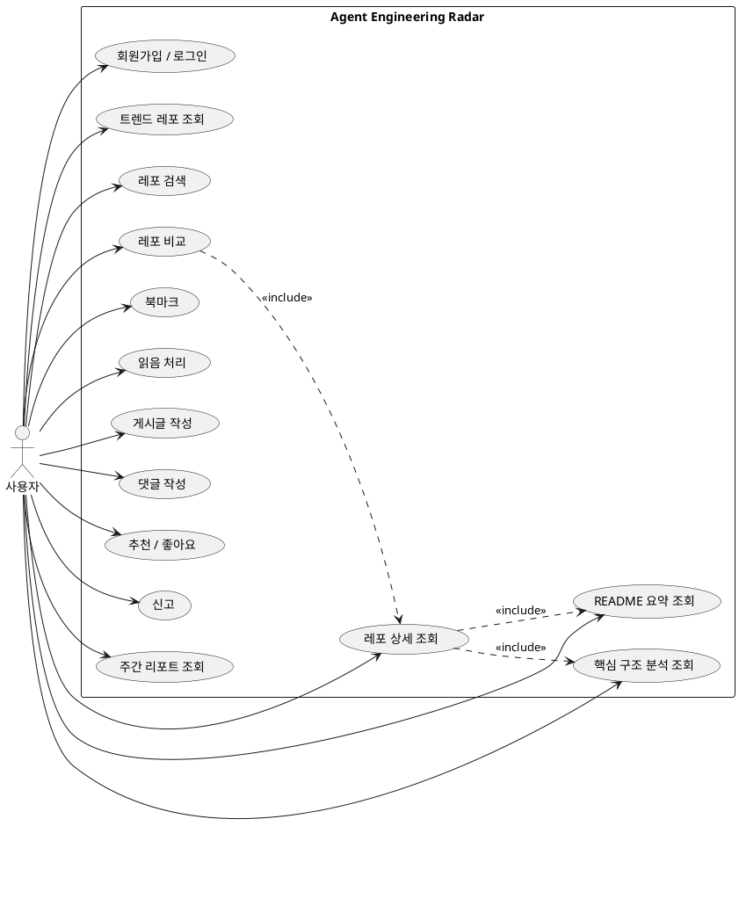
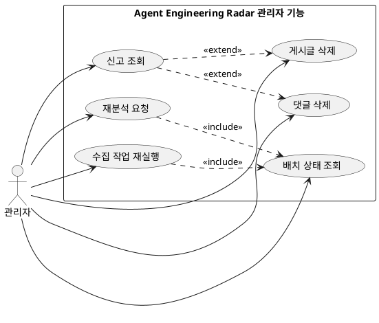
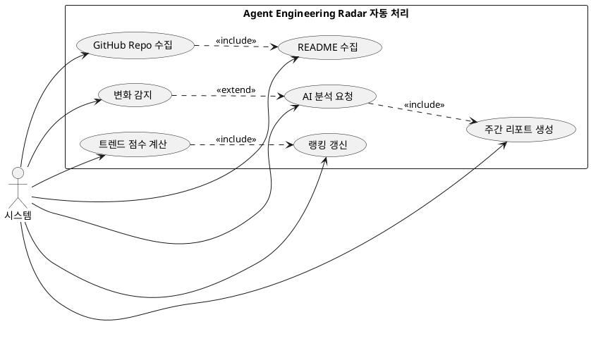

# 유즈케이스

## UC-01. 기술 트렌드 탐색

### 목적

사용자는 최근 AI Agent 기술 흐름을 빠르게 파악한다.

### 주요 사용자

- 비로그인 사용자
- 로그인 사용자

### 기본 흐름

1. 사용자가 메인 화면에 진입한다.
2. 시스템은 이번 기간의 Agent 기술 트렌드 및 팔로우업 목록을 보여준다.
3. 사용자는 MCP, 레포지토리 카드, Eval, Tool-use 등 주요 흐름을 확인한다.
4. 사용자는 주목할 레포지토리 목록을 확인한다.
5. 사용자는 관심 있는 흐름이나 레포지토리를 선택한다.

### 제공 정보

- 이번 기간 주목할 Agent 레포지토리
- MCP 관련 흐름
- 레포지토리 카드(Skill) 관련 흐름
- Eval / Harness 관련 흐름
- Tool-use 관련 흐름
- 다음에 볼 만한 키워드

---

## UC-02. 관심 레포지토리 탐색

### 목적

사용자는 직접 확인해볼 만한 레포지토리를 고른다.

### 주요 사용자

- 비로그인 사용자
- 로그인 사용자

### 기본 흐름

1. 사용자가 팔로우업 목록을 조회한다.
2. 시스템은 추천 레포지토리를 보여준다.
3. 사용자는 레포지토리 카드별 설명, 유형, 추천 이유를 확인한다.
4. 사용자는 Agent 유형이나 기술 흐름 기준으로 레포지토리를 탐색한다.
5. 사용자는 확인할 레포지토리를 선택한다.

### 제공 정보

- 레포지토리 이름
- 한 줄 설명
- Agent 유형
- 추천 이유
- 위험 요소 여부
- 커뮤니티 피드백 요약

---

## UC-03. 레포지토리 분석 보기

### 목적

사용자는 특정 레포지토리가 어떤 프로젝트이고, 실제로 무엇을 확인해야 하는지 파악한다.

### 주요 사용자

- 비로그인 사용자
- 로그인 사용자

### 기본 흐름

1. 사용자가 레포지토리 상세 화면에 진입한다.
2. 시스템은 자동 분석 결과를 보여준다.
3. 사용자는 README 요약을 확인한다.
4. 사용자는 핵심 구조와 구현 근거 요약을 확인한다.
5. 사용자는 MCP, Skill, Eval, Tool-use 관련 여부를 확인한다.
6. 사용자는 먼저 볼 파일이나 디렉토리를 확인한다.
7. 사용자는 필요하면 GitHub 원본 레포지토리로 이동한다.

### 제공 정보

- README 요약
- 프로젝트 유형
- 주요 Claim
- 구현 근거 정보
- MCP / Skill / Eval / Tool-use 여부
- 위험 요소
- 먼저 볼 파일 또는 디렉토리
- GitHub 원본 링크

---

## UC-04. 내 관심 레포지토리 관리

### 목적

사용자는 나중에 확인할 레포지토리와 이미 확인한 레포지토리를 관리한다.

### 주요 사용자

- 로그인 사용자

### 기본 흐름

1. 사용자가 관심 있는 레포지토리를 북마크한다.
2. 시스템은 해당 레포지토리를 사용자 관심 목록에 저장한다.
3. 사용자는 레포지토리를 읽음 처리한다.
4. 사용자는 내 관심 레포지토리 목록을 조회한다.
5. 사용자는 확인한 레포지토리와 아직 확인하지 않은 레포지토리를 구분한다.
6. 북마크한 레포지토리의 중요 변동사항(star 급증, 업데이트, release 등록 등) 발생 시 알림을 받는다.

### 제공 기능

- 북마크
- 읽음 처리
- 관심 레포지토리 목록 조회
- 나중에 볼 레포지토리 저장
- 확인 / 미확인 상태 구분
- 관심 레포지토리 변경 알림 수신

---

## UC-05. 커뮤니티 참여

### 목적

사용자는 레포지토리에 대한 의견, 후기, 실행 경험을 공유한다.

### 주요 사용자

- 로그인 사용자
- 비로그인 사용자 (조회만 가능)

### 기본 흐름

1. 사용자가 레포지토리 상세 화면에서 커뮤니티 영역을 확인한다.
2. 사용자는 다른 개발자의 댓글, 후기, 실행 경험을 읽는다.
3. 로그인 사용자는 댓글이나 후기를 작성한다. (비로그인 사용자는 작성 기능이 제한된다.)
4. 로그인 사용자는 실행 경험이나 참고 정보를 공유한다.
5. 로그인 사용자는 유사 레포지토리나 비교 대상을 제안한다.

### 제공 기능

- 댓글 작성
- 토론 참여
- 반응 남기기
- 사용 후기 작성
- 실행 경험 공유
- 유사 레포지토리 추천
- 참고 정보 공유

---

## UC-06. 신고 및 수정 요청

### 목적

사용자는 잘못된 자동 분석 결과나 부적절한 커뮤니티 내용을 신고한다.

### 주요 사용자

- 로그인 사용자
- 관리자

### 기본 흐름

1. 사용자가 잘못된 자동 분석 결과를 발견한다.
2. 사용자는 분석 오류 또는 수정 요청을 제출한다.
3. 시스템은 신고 내용을 저장한다.
4. 관리자는 신고 내용을 검토한다.
5. 관리자는 필요하면 레포지토리 재분석을 요청하거나 잘못된 정보를 숨김 처리한다.

### 제공 기능

- 분석 오류 신고
- 잘못된 정보 수정 요청
- 구현 근거 보완 제안
- 부적절한 댓글 신고
- 재분석 요청
- 관리자 검토
- 레포지토리 카드 숨김 처리

---

## UC-07. 레포지토리 수집·분석·갱신

### 목적

시스템은 Agent 관련 GitHub 레포지토리를 수집하고 자동 분석 결과를 최신 상태로 유지한다.

### 주요 사용자

- 시스템
- 관리자

### 기본 흐름

1. 시스템은 Agent 관련 GitHub 레포지토리 후보를 수집한다.
2. 시스템은 레포지토리 메타데이터와 README 정보를 수집한다.
3. 시스템은 Agent 관련 여부를 판단한다.
4. 시스템은 README 요약과 레포지토리 자동 분석 결과를 생성한다.
5. 시스템은 MCP, Skill, Eval, Tool-use 관련 정보를 탐지한다.
6. 시스템은 신규 레포지토리 또는 변경 레포지토리를 우선 갱신한다.
7. 시스템은 자동 분석 결과를 내부 데이터셋에 저장한다.

### 처리 기능

- GitHub 레포지토리 후보 수집
- 레포지토리 메타데이터 수집
- README / 문서 수집
- Agent 관련성 판단
- AI 분석 생성
- 레포지토리 변화 감지
- 신규 / 변경 레포지토리 재분석
- 내부 데이터셋 갱신

---

## UC-08. 자유게시판 이용

### 목적

사용자는 AI / Agent 기술 관련 자유 주제에 대해 지식을 공유하고 소통한다.

### 주요 사용자

- 로그인 사용자
- 비로그인 사용자 (조회만 가능)

### 기본 흐름

1. 사용자가 자유게시판 목록 화면에 진입한다.
2. 시스템은 등록된 자유 게시글 목록을 보여준다.
3. 사용자는 특정 게시글을 선택하여 상세 내용을 조회한다.
4. 로그인 사용자는 새 게시글을 작성, 수정, 삭제하거나 기존 게시글에 댓글을 등록, 수정, 삭제한다.

### 제공 기능

- 자유게시판 게시글 및 댓글 조회
- 자유 게시글 작성/수정/삭제
- 댓글 작성/수정/삭제

---

## UC-09. 레포지토리 비교 분석 (F06 관련)

### 목적

사용자는 두 개 이상의 레포지토리를 선택해 README Claim 및 구현 근거를 상호 비교 분석한다.

### 주요 사용자

- 로그인 사용자
- 비로그인 사용자

### 기본 흐름

1. 사용자가 상세 화면 또는 탐색 리포트에서 '레포지토리 비교'를 요청한다.
2. 사용자가 비교 대상이 될 다른 레포지토리를 검색하여 추가한다. (동시 비교는 최대 3개로 제한된다.)
3. 시스템은 선택된 레포지토리들의 유형, Claim, 구현 근거, 커뮤니티 피드백을 나란히 비교 레이아웃으로 출력한다.
4. 사용자는 비교 결과를 확인하고 개별 레포지토리로 이동할 수 있다.

### 제공 기능

- 비교 대상 레포지토리 선택/제거
- 핵심 요약 및 구현 신호 대비 레이아웃 제공

---

# 유즈케이스 요약

|번호|유즈케이스|핵심 목적|
|---|---|---|
|UC-01|기술 트렌드 탐색|최근 Agent 기술 흐름을 파악한다|
|UC-02|관심 레포 탐색|확인할 만한 레포지토리를 고른다|
|UC-03|레포지토리 분석 보기|레포지토리의 내용과 확인 포인트를 이해한다|
|UC-04|내 관심 레포지토리 관리|관심 레포지토리를 저장/알림받고 관리한다|
|UC-05|커뮤니티 참여|의견, 후기, 실행 경험을 공유한다|
|UC-06|신고 및 수정 요청|오류나 부적절한 내용을 제보한다|
|UC-07|레포지토리 수집·분석·갱신|시스템이 데이터를 수집하고 최신화한다|
|UC-08|자유게시판 이용|자유 게시글을 통해 기술에 대해 토론하고 소통한다|
|UC-09|레포지토리 비교 분석|레포지토리들의 Claim 및 구현 근거를 비교 분석한다|